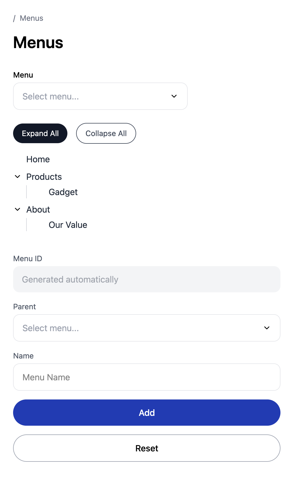

# 📦 Menu Tree — Fullstack Application

A full‑stack application for creating, managing, and visualizing menus as a tree. It uses **NestJS** for the backend, **React (Vite)** for the frontend, and **PostgreSQL** for persistent storage. The repository contains both backend and frontend code and includes **Docker** resources for easy local development.

---

## 🚀 Tech Stack

### Frontend

- **React** (Vite)
- **TypeScript**
- **TailwindCSS**

### Backend

- **NestJS**
- **TypeScript**
- **PostgreSQL** (via Docker)
- **Prisma**
- **Swagger** for API documentation

### Development Tools

- **Docker** & **Docker Compose**
- **Node.js** (v22+ recommended)
- `npm` / `pnpm` / `yarn`

---

## 📂 Project Structure

```bash
.
├── apps/
│   └── backend/         # NestJS API server
│   └── frontend/        # React + Vite client
├── docker/              # Docker-related resources
│   └── postgres/
│       └── data/        # Local Postgres volume (ignored by Git)
└── docker-compose.yml   # Database container
```

---

## 🛠️ Local Development

### 1. Clone the repository

```bash
git clone https://github.com/shagaranasution/menu-tree.git
cd menu-tree
```

---

## 🗄️ Database Setup (PostgreSQL via Docker)

Make sure you have Docker Desktop installed in your local mechine. You can download on [Docker's website](https://www.docker.com), then select Download Docker Desktop.

### 1. Create a .env file

Create a .env file in the project root:

```bash
# .env
POSTGRES_USER=YOUR_POSTGRES_USER
POSTGRES_PASSWORD=YOUR_POSTGRES_PASSWORD
POSTGRES_DB=YOUR_POSTGRES_DB_NAME
```

### 2. Start PostgreSQL

```bash
docker compose up -d
```

---

## 🧩 Backend (NestJS)

### 1. Install dependencies

```bash
cd apps/backend
npm install
```

### 2. Configure environment

Create apps/backend/.env:

```bash
# .env
PORT=3001
CORS_ORIGINS="http://localhost:5173"
DATABASE_URL=YOUR_DB_CONNECTION_STRING
```

### 3. Run Prisma migrate

```bash
npm run migrate:dev
```

### 4. Run the backend

```bash
npm run start:dev
```

API will run at http://localhost:3001

### 5. Swagger Documentation

After starting the server:

```bash
http://localhost:3001/api/docs
```

---

## 🎨 Frontend (React + Vite)

### 1. Install dependencies

```bash
cd apps/frontend
npm install
```

### 2. Configure .env

Create apps/frontend/.env:

```bash
VITE_BACKEND_URL=http://localhost:3001
```

### 3. Run dev server

npm run dev
Frontend UI will be available at http://localhost:5173

---

## 🍔 Monorepo

Inside project root:

### 1. Install dependencies

```bash
npm install
```

### 2. Run Prisma migrate

```bash
npm run db:migrate:dev
```

### 3. Run the backend & Frontend concurrently

```bash
npm run dev
```

---

## 📜 Scripts

Backend (/apps/backend)

```bash
npm run start:dev     # Start backend in watch mode
npm run build         # Build backend
npm run start:prod    # Start production server
```

Frontend (/apps/frontend)

```bash
npm run dev           # Start Vite dev server
npm run build         # Build production client
npm run preview       # Preview production build
```

---

## Screenshots

### Desktop

[](https://raw.githubusercontent.com/shagaranasution/menu-tree/refs/heads/master/screenshots/ss_1.png)

### Mobile

[](https://raw.githubusercontent.com/shagaranasution/menu-tree/refs/heads/master/screenshots/ss_2.png)
